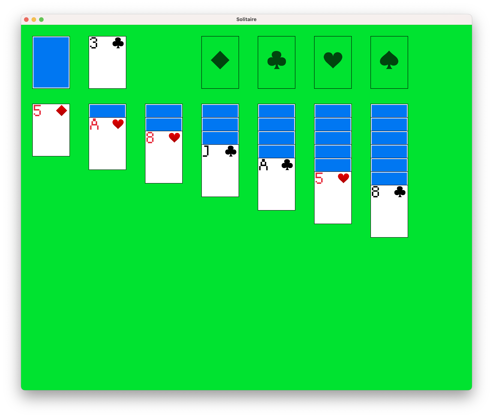

# Solitaire-macroquad

A [solitaire/klondike](https://en.wikipedia.org/wiki/Klondike_(solitaire)) clone written in Rust using the [macroquad](https://github.com/not-fl3/macroquad) 2D graphics library.

Built entirely for fun!

# Running the game

1. Clone this repository
2. `cargo run`

# How to play

Familiarity with the rules of Solitaire are assumed.

- Click on a card to move it.
  - If there's only one valid move, it will be automatically made.
  - If there are multiple valid moves, click the desired destination for that card to complete the move (click anywhere else to cancel).
- Click on the stock (top-left face-down cards) to cycle the available stock card.

# Shortcuts

| Key      | What it does                                        |
| ---      | ---                                                 |
| Spacebar | Cycles the stock by one card                        |
| R        | Generates a new game                                |
| D        | Prints a debug log of the game state in the console |
| A        | Auto-move (note: it's pretty dumb)                  |

# TODO / wishlist

- [ ] Undo
- [ ] Animations
- [ ] Move hints
- [ ] A game over message / win-screen
- [ ] Any kind of decent UX at all
